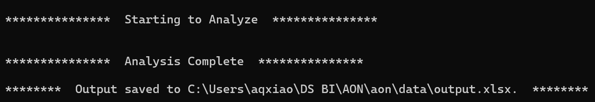

# AON Deal Incremental Gains Calculation

## 1. SQL 

### 1.1 Edit your query as needed

* Path where the script could be found may look something like this - 

        C:\Users\yourUserName\Desktop\aon\scripts\coop_per_asin.sql

* Fields subject to change:
    * region (i.e., `region_id`) & marketplace (i.e., `marketplace_key`)
    * GL (i.e., `promotion_product_group_key`)
    * promotion time window (i.e., `start_datetime BETWEEN date1 AND date2`)

### 1.2 Run your edited script on [workbench](https://datacentral.a2z.com/workbench)

### 1.3 Save your query locally
* Path where your data is saved could look something like this

        C:\Users\yourUserName\Desktop\aon\data\aon_deals.xlsx

## 2. [Optional] Python

Python script in this section will calculate the incremental gains for you in 3 lines. That said, though it's encouraged to leverage automation to avoid possible human errors, manual calculation is also a valid option if that's your preference.

### 2.1 Install Python & Required Libraries
Now we need to make sure that your computer is ready to run a python script.
* Install [Python](http://softwarecenter:SoftwareID=ScopeId_6C900AD6-A53B-4C44-B96C-1002E20C5DF9/Application_beaa76ce-05e1-481d-bec0-98dcc6b16f38) through Software Center

* Open terminal. Run following commands - one line at a time.

```
pip3 install pandas
pip3 install numpy
pip3 install openpyxl --upgrade
```
Your computer is now ready to run the Python script.


### 2.2 Run Python Script

#### 2.2.1 Example directroy 

* Directory structure used in this instruction manual looks like below -

    ```
    .
    ├── aon/
    |   │
    │   ├── data/
    │   │    └── aon_deals.xlsx
    │   │
    │   ├── scripts/
    │       ├── analytics.py
    │       └── coop_per_asin.sql

    ```

* You can save the data and scripts wherever you like. But if you want to follow the same structure as your example and save the base folder `aon` on your Desktop, your directory would look something like below -

    ```
    C:\Users\yourUserName\Desktop\aon\scripts
    ```

#### 2.2.2 Call python script in terminal

* First, find Terminal from Menu.

    


* Find the directory where you're storing the scripts in your File Explorer. Copy that address.


    


* Then change directory like below with your own directory path. It should look something like this - 
    
    ```
    cd "C:\Users\aqxiao\DS BI\AON\aon\scripts"
    ```

    **⚠️ IMPORTANT ⚠️**

    You must <span style="color:red">**add quotations marks around your path**</span>.

* Next, call Python script

    ```
    python analytics.py
    ```

* The script will do all of the analytics from here. Once it's done, you should see the completion message - 

    

* Now you can find your output in the path described above.