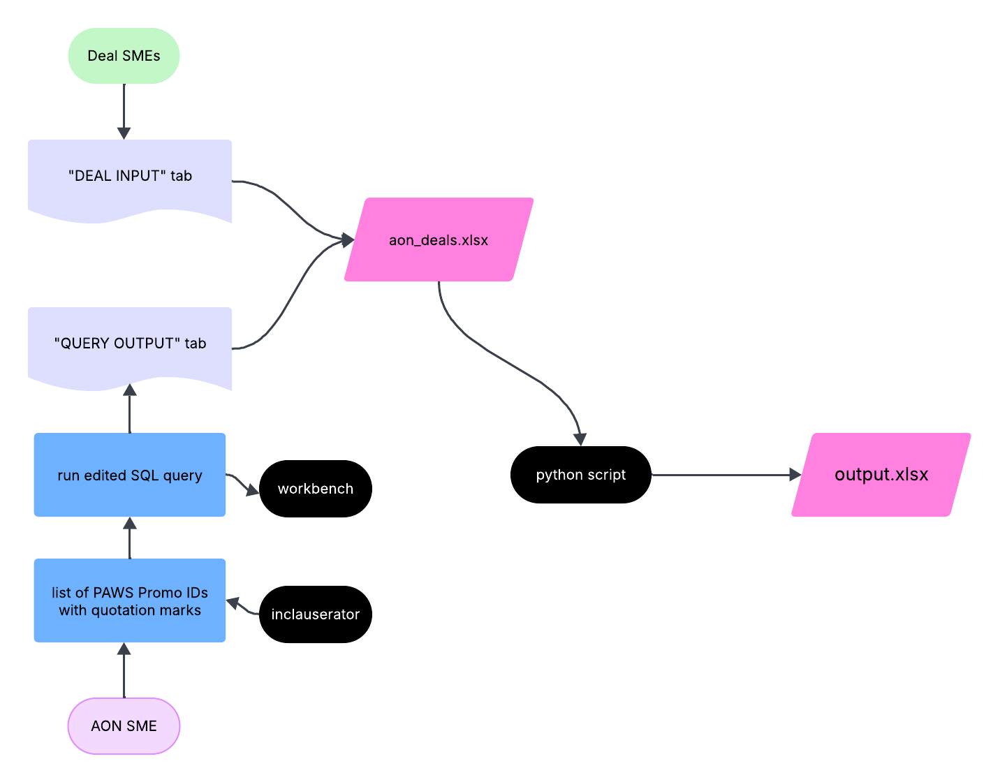

# AON Deal Incremental Gains Calculation

## 0. Workflow



## 1. Data Prep

*The goal of Section One is to create an excel file with two tabs that we will input into a Python script in Section Two.*

### 1.1 Receive table from Deal SMEs with information shown as below:

| asin | paws_promotion_id | created_by |
|---|---|---|
| B0CVHHF5MR | 311891281213| aqxiao |

*<span style="color: red">NOTE: for paws_promotion_id, you must format it as numbers and set decimal place to 0.</span>*


### 1.2 Create a new excel file
* Let’s save it on desktop and name it `aon_deals.xlsx`
* Create the first tab as DEAL SME INPUT`.
* Reformat excel sheet Deal SMEs shared like table below 
* Save file


### 1.3 Query
* Use [inclauserator](https://inclauserator.corp.amazon.com/inclauserator/submit) to add quotation marks around your list of PAWS Promo IDs
* Edit query as per your needs
    * For `WHERE` clause in `filtered_promos`, filter for your deal ASINs' `paws_promo_id`s (based on Deal SMEs' input)
    * For `WHERE` clause in the `t4w_promo_asp`, filter for T4W period based on your promo start date 
* Run [query](https://github.com/angie-xiao/aon/blob/main/scripts/coop_per_asin.sql) on [workbench](https://datacentral.a2z.com/workbench)

### 1.4 Go back to the `aon_deals.xlsx` file you just created
* Create second tab. Let’s call it `QUERY OUTPUT`.
* Download result and save it to the `QUERY OUTPUT` tab you just created. 


## 2. Install Python & Required Libraries
*Now we need to make sure that your computer is ready to run a python script.*
* Install [Python](http://softwarecenter:SoftwareID=ScopeId_6C900AD6-A53B-4C44-B96C-1002E20C5DF9/Application_beaa76ce-05e1-481d-bec0-98dcc6b16f38) through Software Center
* Open terminal. Run following commands - one line at a time.

```
pip3 install pandas
pip3 install numpy
pip3 install openpyxl --upgrade
```
Your computer is now ready to run the Python script.


## 3. Run Python Script

### 3.1 Let’s first find your file path by right click on the excel file you just saved on desktop


### 3.2 Call python script